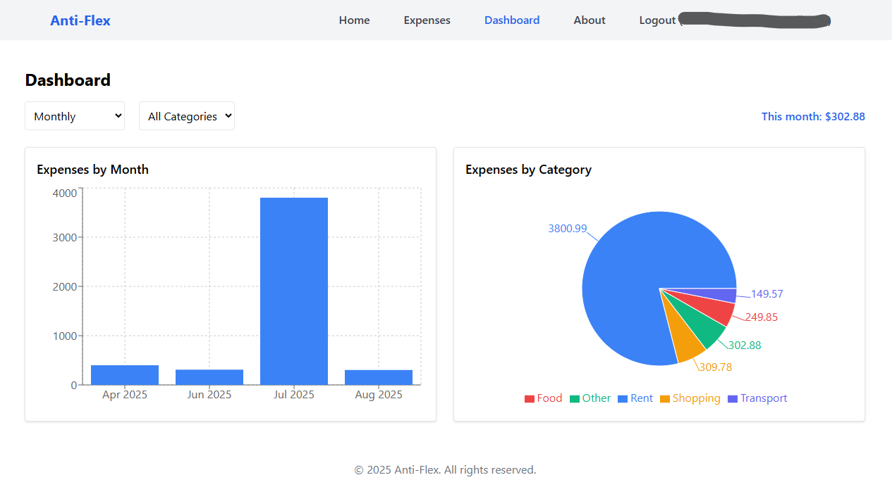
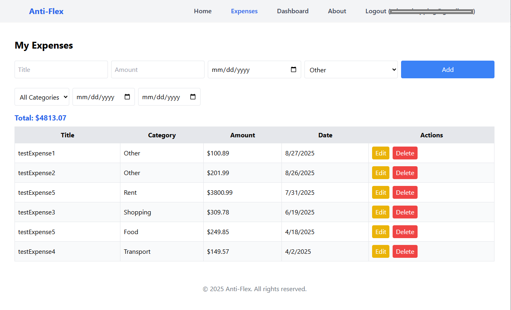

# Anti-Flex 💰

A full-stack **Anti-Flex** application built with **React (Vite)** on the frontend and **Node.js + Express + AWS Lambda** on the backend. Users can register, log in via **AWS Cognito**, and manage expenses stored in **AWS DynamoDB**, with interactive charts and dashboards.

---

## 🚀 Tech Stack

### Frontend
- **React (Vite)**
- **TailwindCSS**
- **Recharts**
- **React Router**
- **Axios**
- **AWS Amplify** (hosting & CI/CD)

### Backend
- **Node.js + Express**
- **AWS Lambda + API Gateway**
- **DynamoDB**
- **Cognito**
- **serverless-http**

---

## ✨ Features
- 🔐 User authentication (Cognito)  
- 📊 Dashboard with monthly, weekly, and custom range charts  
- 📝 CRUD operations on expenses  
- 🗂️ Category & date filters  
- 📈 Monthly totals & insights  
- ☁️ Serverless & auto-deployed via GitHub  

---

## 🖼️ Screenshots

### Dashboard

### Expenses Page

---

